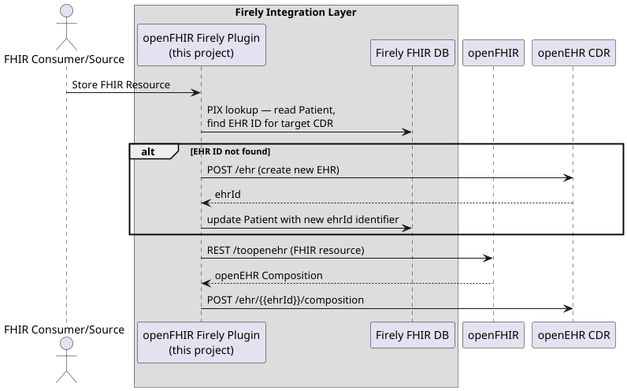

[](LICENSE)

# openFHIR Firely Server Plugin

This project is a [Firely Server](https://fire.ly/products/firely-server/) plugin that transparently routes clinical data between FHIR clients and an openEHR Clinical Data Repository (CDR). It sits inside a standard Firely Server instance and acts as an integration layer — selectively intercepting requests that should be handled by the CDR while letting everything else pass through to Firely as normal.

The translation between FHIR and openEHR formats is handled by
[openFHIR](https://open-fhir.com/), a mapping service that converts FHIR resources to openEHR
Compositions and vice versa using configurable template-based mappings.

> This is simply a plugin designed to operate on an already running Firely Server instance. It is not intended to modify
> or customize Firely itself, but rather to make use of Firely's established plugin and middleware patterns. See "How to use it"
> section below on how you can use it within your Firely Server.

> See https://github.com/openFHIR/openfhir-hapi-interceptor if you're looking for a HAPI Interceptor.

## How it works

### Storing FHIR data in openEHR

When a FHIR resource is posted with a profile that matches a configured list, the plugin
forwards it to openFHIR for conversion into an openEHR Composition, then stores it directly in the
CDR. The resource never reaches Firely's storage layer.



### Querying openEHR data as FHIR

When a FHIR search request matches a configured rule, the plugin translates it to an openEHR
AQL query via openFHIR, executes it against the CDR, then converts the results back to FHIR before
returning them to the client. Again, Firely is not involved.


### Serving an IPS patient summary (`$summary`)

The plugin also exposes a Firely middleware handler for the standard FHIR
`GET /fhir/Patient/{id}/$summary` operation, returning an
[International Patient Summary (IPS)](https://hl7.org/fhir/uv/ips/) Bundle gathered from the configured openEHR CDR.

> Implementation is at this time limited only to Allergies and Conditions.


---

## How to use it

Firely Server supports loading additional functionality via plugins — assemblies dropped into a
`plugins/` directory that are picked up on startup. This project produces a DLL that is placed
into a standard Firely Server deployment — no modifications to Firely itself are required.

### Requirements

- .NET 8
- Firely Server 6.5+ (with a license allowing you to run custom plugins)

### Running a whole stack with Docker Compose

A [`docker-compose.yml`](docker-compose.yml) is provided that wires Firely Server together with EHRbase and its
PostgreSQL database. The `appsettings.json` is mounted as Firely Server's configuration file. The `cdrs.yml` is mounted at the
path referenced by `OpenFhirPlugin.Interceptor.CdrsConfigFile` in `appsettings.json`.

First build the plugin to populate the `plugins/` directory:

```bash
dotnet build -c Release
```

Then start the stack (no Docker build step needed — Firely Server is pulled as a pre-built image):

```bash
docker compose up
```

> You either need to include an openFHIR container in the docker-compose or configure your sandbox access.

---

## Configuration

You need to configure the connected openEHR CDRs along with your openFHIR instance.

The following configuration options are available (see the example in [`appsettings.json`](appsettings.json)):

### CDR registry (`CdrsConfigFile`)

The plugin can target multiple openEHR CDRs. The registry is defined in a separate YAML file
whose path is set via `OpenFhirPlugin.Interceptor.CdrsConfigFile`.

The file is re-read on every request — no restart is required when CDR entries are added or changed.

**`cdrs.yml` format:**

```yaml
- id: local                            # unique identifier, used in X-OpenEhrCdr header
  name: EHRbase (local)               # human-readable label (informational only)
  baseUrl: http://ehrbase:8080/ehrbase/rest  # base REST URL of the CDR
  authMethod: basic                   # none | basic | oauth2
  basicAuth:
    username: ehrbase-user
    password: secret

- id: remote
  name: Cadasto
  baseUrl: https://cadasto.example.com
  authMethod: oauth2
  oauth2:
    tokenUrl: https://auth.example.com/token
    clientId: my-client
    clientSecret: my-secret
    scope: openid profile              # optional, space-separated
    authMethod: body                   # body (default) or basic — how credentials are sent to the token endpoint
    extraParams:                       # optional extra key/value pairs added to the token request body
      audience: cadasto-api
```

**CDR entry fields:**

| Field | Required | Description |
|---|---|---|
| `id` | yes | Unique identifier matched against the `X-OpenEhrCdr` request header |
| `name` | no | Human-readable label, used only in logs |
| `baseUrl` | yes | Base REST URL of the CDR (no trailing slash) |
| `authMethod` | yes | `none`, `basic`, or `oauth2` |
| `basicAuth.username` | if `authMethod: basic` | HTTP Basic username |
| `basicAuth.password` | if `authMethod: basic` | HTTP Basic password |
| `oauth2.tokenUrl` | if `authMethod: oauth2` | Token endpoint URL |
| `oauth2.clientId` | if `authMethod: oauth2` | OAuth2 client ID |
| `oauth2.clientSecret` | if `authMethod: oauth2` | OAuth2 client secret |
| `oauth2.scope` | no | Space-separated scopes added to the token request |
| `oauth2.authMethod` | no | How to send credentials to the token endpoint: `body` (default) or `basic` |
| `oauth2.extraParams` | no | Additional key/value pairs added to the token request body (e.g. `audience`) |

The CDR to use on a given request is selected via the `X-OpenEhrCdr` request header, matched
against the `id` field.

| Scenario | Behaviour |
|---|---|
| Header present, known `id` | routes to that CDR |
| Header present, unknown `id` | falls back to first CDR (warns) |
| Header absent | falls back to first CDR (warns) |
| Header value is `fhir` | passes through to Firely (create flow only) |
| Comma-separated values (e.g. `local,cloud`) | provisions EHR in all listed CDRs (Patient create only) |

### openFHIR service (`OpenFhir.BaseUrl`)

```json
{
  "OpenFhirPlugin": {
    "OpenFhir": {
      "BaseUrl": "https://sandbox.open-fhir.com",
      "OAuth2": {
        "TokenUrl": "https://sandbox.open-fhir.com/auth/realms/open-fhir/protocol/openid-connect/token",
        "ClientId": "my-client",
        "ClientSecret": "my-secret",
        "Scope": ""
      }
    }
  }
}
```

---

## Technical Details

### FhirCreateMiddleware

An ASP.NET Core middleware that sits in front of Firely Server and intercepts inbound `POST` requests,
routing them to an openEHR CDR instead of letting Firely store them, when a configured profile matches.

#### When it triggers

A request is intercepted when **all** of the following are true:

1. The HTTP method is `POST`
2. The `X-OpenEhrCdr` request header is present and is not `fhir` (requests explicitly targeting Firely pass through)
3. The parsed FHIR resource has at least one entry in `meta.profile` that matches a URL in
   `InterceptedProfiles`

Profile matching checks the resource itself first. For `Bundle` resources, if the bundle's own meta does not match, each
entry resource is also checked in order.

#### Flow

```
POST /fhir
    │
    ├─ not POST?                         → pass through to Firely
    ├─ no or "fhir" X-OpenEhrCdr header? → pass through to Firely
    ├─ body not parseable as FHIR?       → pass through to Firely
    ├─ no configured profile matched?    → pass through to Firely (logged at INFO)
    │
    └─ profile matched (logged at INFO)
           │
           ├─ resolve patient ID from resource
           │     ├─ Bundle → recurse into each entry resource
           │     └─ any resource type → try per-type FHIRPath expressions in order
           │           (e.g. Observation: subject → performer)
           │           filters to references of type Patient, returns first non-blank ID part
           ├─ look up EHR ID via PIX manager (local patient Firely store)
           │     └─ if not found → provision new EHR on CDR
           ├─ convert resource to openEHR format via openFHIR
           ├─ store on CDR
           └─ return HTTP 201 + Location header  (Firely never sees the request)
```

#### Configuration

```json
{
  "OpenFhirPlugin": {
    "Interceptor": {
      "FhirCreateFilter": {
        "InterceptedProfiles": [
          "http://hl7.org/fhir/uv/ips/StructureDefinition/Composition-uv-ips"
        ]
      }
    }
  }
}
```

#### Patient reference resolution

The middleware must extract a patient ID from the resource in order to look up or provision an EHR.
For `Bundle` resources it recurses into each entry. For all other resource types it tries a set of
FHIRPath expressions in priority order, keeping the first reference whose resource type is `Patient`
(or is untyped).

---

### FhirQueryMiddleware

An ASP.NET Core middleware that intercepts FHIR search `GET` requests and routes them to openEHR
instead of Firely. Which requests are intercepted is fully driven by configuration — there are no
hardcoded resource types or template IDs.

#### When it triggers

A request is intercepted when **all** of the following are true:

1. The HTTP method is `GET`
2. A `patient` query parameter is present (used to resolve the EHR ID)
3. At least one configured rule matches the request (see Configuration below)

If no rule matches, the request passes through to Firely (logged at INFO).

#### Flow

```
GET /fhir/AllergyIntolerance?patient=123
    │
    ├─ not GET?              → pass through to Firely
    ├─ no patient param?     → pass through to Firely
    ├─ no rule matched?      → pass through to Firely (logged at INFO)
    │
    └─ rule matched (logged at INFO)
           │
           ├─ resolve EHR ID via PIX manager (local patient Firely store)
           │     └─ if not found → error (no provisioning for query path)
           ├─ build fhirPath (/ResourceType?remaining-params, patient excluded)
           ├─ call openFHIR /toaql with templateId from matched rule
           ├─ execute returned AQLs against CDR (skipping COMPOSITION-type AQLs)
           ├─ call openFHIR /tofhir with AQL result rows
           ├─ filter result bundle to requested resource type
           └─ return HTTP 200 searchset Bundle  (Firely never sees the request)
```

#### Configuration

Rules are evaluated in order; the first match wins. Each rule has:

- `TemplateId` — the openEHR template ID passed to openFHIR
- `FhirQuery` — key/value pairs that must **all** be present on the incoming request

The special key `_resourceType` matches against the last path segment of the URI (e.g. `AllergyIntolerance`) rather than
a query parameter.

```json
{
  "OpenFhirPlugin": {
    "Interceptor": {
      "FhirQueryFilter": {
        "Rules": [
          {
            "TemplateId": "International Patient Summary",
            "FhirQuery": { "_resourceType": "AllergyIntolerance" }
          },
          {
            "TemplateId": "International Patient Summary",
            "FhirQuery": { "_resourceType": "Condition" }
          },
          {
            "TemplateId": "International Patient Summary",
            "FhirQuery": { "_resourceType": "MedicationStatement" }
          }
        ]
      }
    }
  }
}
```

Rules can also match on additional query parameters:

```json
{
  "TemplateId": "Some Other Template",
  "FhirQuery": { "_resourceType": "Observation", "category": "laboratory" }
}
```

#### Matching semantics

A rule matches when **every** criterion in its `FhirQuery` map is satisfied by the request.
Extra parameters present in the URL but not in the rule are ignored.

Given this rule:

```json
{
  "TemplateId": "International Patient Summary",
  "FhirQuery": { "_resourceType": "Observation", "category": "laboratory" }
}
```

| Request URL                                                          | Matches? | Reason                                                                                            |
|----------------------------------------------------------------------|----------|---------------------------------------------------------------------------------------------------|
| `GET /fhir/Observation?patient=123&category=laboratory`              | yes      | all criteria satisfied                                                                            |
| `GET /fhir/Observation?patient=123&category=laboratory&status=final` | yes      | extra `status` param is ignored at matching, but will be forwarded to openFHIR for AQL generation |
| `GET /fhir/Observation?patient=123&category=vital-signs`             | no       | `category` value differs                                                                          |
| `GET /fhir/Observation?patient=123`                                  | no       | `category` criterion not satisfied                                                                |
| `GET /fhir/Condition?patient=123&category=laboratory`                | no       | `_resourceType` is `Condition`, not `Observation`                                                 |

Rules are evaluated in order and the first match wins, so put more specific rules (more criteria) before broader ones.

##### Wildcard value `*`

Setting a criterion value to `*` means the key must be present but any value is accepted.
For `_resourceType`, `*` matches any resource type present in the URI — it will still not match
requests with no resource type segment.

```json
[
  {
    "TemplateId": "My Template",
    "FhirQuery": { "_resourceType": "Observation", "category": "*" }
  },
  {
    "TemplateId": "My Template",
    "FhirQuery": { "_resourceType": "*", "status": "final" }
  }
]
```

| Request URL                                            | `_resourceType=Observation, category=*` | `_resourceType=*, status=final` |
|--------------------------------------------------------|-----------------------------------------|---------------------------------|
| `GET /fhir/Observation?patient=1&category=laboratory`  | yes                                     | no — no `status` param          |
| `GET /fhir/Observation?patient=1&category=vital-signs` | yes                                     | no — no `status` param          |
| `GET /fhir/Observation?patient=1`                      | no — `category` absent                  | no — no `status` param          |
| `GET /fhir/Condition?patient=1&status=final`           | no — wrong resource type                | yes                             |
| `GET /fhir/Observation?patient=1&status=final`         | no — `category` absent                  | yes                             |
